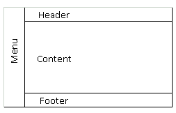

# Criação de site para clínica médica

Você deve criar um site para um clínica médica. A especialidade escolhida foi cardiologia.

Todas as páginas seguiram o padrão definido na foto abaixo:

* No menu, devem ficar os links das outras páginas;
* No header, vai ficar um logotipo;
* No rodapé, vai ficar informações de contato;
* No content, vai mudar de página para página;

O objetivo é imaginar que estivéssemos recebendo um trabalho freelancer de uma clínica médica com as seguintes funcionalidades:

* ## Página Principal;

* Na página principal deve ter uma imagem no **header**.
* No **content**, uma breve descrição sobre a página;
* No **menu** e no **footer**, será igual para todas as páginas;

***
* ## Sobre a clínica;

* Deve ter uma imagem diferente da página principal no **header**;
* No **content**, um texto mais completo falando sobre a clínica;
* No **menu** e no **footer**, será igual para todas as páginas;

***
* ## Horário de atendimento;

* Deve ter uma nova imagem no **header**;
* No **content**, deve um texto falando sobre os serviços e uma tabela no seguinte padrão.

* No **menu** e no **footer**, será igual para todas as páginas;

***
* ## Contato;

* Uma imagem diferente no **header**.

* Em **content**:

   *   Telefone de contato da clínica;
   *   Endereço completo da clínica;
   *   Uma parte mostrando a localização da clínica no **GoogleMaps**;
* A página de contato deve solicitar as seguintes informações do usuário.
   *   Nome;
   *   Endereço de email;
   *   Assunto;
   *   Mensagem ;
   *   Endereço completo;
   *   Botões de enviar e limpar o formulário;

* No **menu** e no **footer**, será igual para todas as páginas;