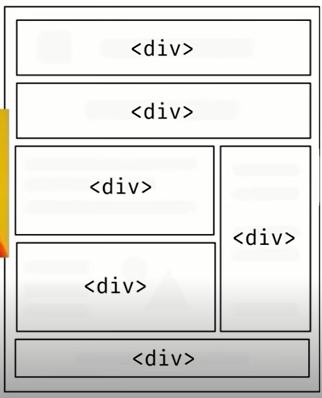
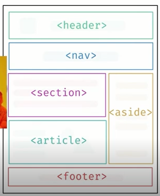

# Entendendo o HTML Semântico

O objetivo é que você vire um expert em semântica no HTML. Lembrando que semântica, no desenvolvimento web, é construir o seu HTML de forma que, batendo o olho, seja possível identificar o que ele representa.

***

## HTML Semântico

**Semâtica**: O estudo do significado das palavras. No nosso caso, tratamos do significado do nosso HTML.

Quando se trata desse assunto, o HTML5 evoluiu muito com relação à sua versão anterior, com tags que fazem sentido, ou seja, você bate o olho e entende. Nas verões, você precisava usar divs com classes que definiam o nome daquela parte da página.

Isso é importante para não ficar na mão dos programadores, uma vez que o que é escrito dentro de uma div pode ser qualquer coisa. Além disso, o HTML não é lido apenas por humanos e esse é o ponto principal.

Comparemos a diferença de semântica entre o HTML5 e suas outras versões:

**À esquerda, outras versões do HTML. À direita, o HTML5:**

   

Além disso, o uso do HTML foi mudado também. Antigamente, nós formatávamos o código no HTML, hoje em dia, nós apenas estruturamos ele. A formatação é papel do  CSS.


***

## Mudanças do HTML5

* Tags ultrapassadas: ```<basefont>```, ```<big>```, ```<center>```, ```<font>```, ```<strike>```, ```<tt>```, ```<frame>```,```<frameset>```...

Novas tags: ```<main>```, ```<header>```, ```<footer>```, ```<nav>```, ```<section>```, ```<aside>```, ```<article>```, ```<video>```... A maioria dessas tags não causam mudanças visuais na sua página, mas são semânticas.

Tudo que não é mais recomendado, fica vermelho no VSCode.


***

## Acessibilidade

A acessibilidade é definida principalmente no HTML. TAmbém tem uma parte relevante no CSS.

Mas, o que é acessibilidade? Acessibilidade é site adaptado para pessoas com deficiências.

Como faço para deixar um site mais acessível? Bom, há uma variedade de coisa a fazer!

Primeiramente, vamos usar o código abaixo como base:

```
<!DOCTYPE html>
<html lang="pt-br">
    <head>
        <meta charset="UTF-8">
        <meta http-equiv="X-UA-Compatible" content="IE=edge">
        <meta name="viewport" content="width=device-width, initial-scale=1.0">
        <title>Página de Exemplo de Acessibilidade - Imagem</title>
    </head>
    <body>
        
    </body>
</html>
```

Veja que não temos o atributo **alt** descrevendo a imagem para máquina. Isso não é acessível, então a primeira dica é: **SEMPRE COLOQUE O ALT**.
``` 

```

Outro ponto é quando um leitor de tela acessa o seu DOM, o seu código HTML, ele não lê ele, mas sim, algo que chamamos de **árvore de acessibilidade**. Essa árvore de acessibilidade é disponibilizada pelo navegador.

Você pode manipular essa árvore através do **ARIA**. É um conjunto de atributos que não mudam o comportamento visual do seu HTML, mas sim da sua árvore de acessibilidade.

*   Como posso ver essa árvore? Você pode ir no inspetor de elementos do seu navegador, procurar a opção **accessibility** e ativar o código fonte dela. 

Em resumo, acessibilidade não é algo simples. Demanda esforço e dedicação, mas algo crucial para quem está começando a programar.
***

## Web-scraping

Antes de começarmos a falar sobre webscraping, vamos falar dos **crawlers** - **rastreadores**, **robo**, **indexador**. É um termo genérico para qualquer programa que entra no seu site e lê o seu HTML. 

Um desse **crawlers** é o **GoogleBot**. Ele varre a sua página e outras página relacionadas a ela.

Quanto mais semântico o seu HTML é, mais fácil é a busca do Google.

***

## Tags ```<main>```, ```<header>``` e ```<footer>```

*   **header**: Sempre no topo, define o cabeçalho da sua página.

*   **main**: Primeiramente, você não pode ter mais de uma tag main no seu site. Ela não pode ser filha das outras tags do HTML5. Ali, fica o assunto principal da sua página. Ela pode conter as outras tags do HTML5, mas nunca ser contida por elas. A única tag que ela pode ser filha é da **div**. Você também não deve colocar conteúdo repetido dentro dela. 

*   **footer**: Sempre no fim da página, define o rodapé da sua página.

* **address**: Usada para colocar endereço. Deixa o texto em itálico por padrão.

***

## Tags ```<nav>```, ```<section>``` e ```<aside>```

* **section**: Resultados de busca onde cada um dos resultados se refere ao mesmo assunto. Não há limites de uso, mas lembre-se, **section** sempre é usada quando você tem uma sequência de informações de busca relacionadas ao mesmo tema. Ela é bem generica, sendo usada para um conteúdo que não possui uma tag específica, porém, se o objetivo dessa **section** era estilização, USE A **div**.

* **aside**: Se refere há assunto externos, assuntos não relacionados ao conteúdo da página. Essa tag sempre deve carregar o que não é importante para a página.

* **nav**: Usada para conter os link de navegação. 


Algo interessante, que está fora do assunto, é que se você precisar criar um site que ao clicar num ícone pelo celular, abra o teclado para ligação, basta colocar na **href** da tag **a** a sintaxe: tel + DDI + DD + número de telefone, exemplo: *tel:+5511912345678* 
***

## Tags ```<article>```, ```<blockquote>``` e ```<q>```

* **article**: É usada para colocar o contéudo central da página aqui. 
    *    ```<time datetime></time>```: Junto com a tag **article**, você pode usar esta tag para informar a data de publicação do artigo. Você pode usar **pubdate** ao invés de **datetime** para tornar o seu HTML ainda mais semântico.

    * ```<blockquote></blockquote>```: Essa tag é utilizada para colocar citações de algum indíviduo ou uma explicação extra no meio do seu artigo. Você pode usar um link da citação na tag **blockquote** usando o atributo **cite=""**. Daí você informa a fonte da sua informação.
    
    *  ```<q></q>```: Com  a ideia de citação em mente, vamos falar tag **q**. Ela também é uma tag para citação, contudo, a citação deve ser de uma linha apenas. Visualmente, ela não quebra linha. Você também pode usar o atributo **cite** aqui também.


***

## Tags ```<figure>```, ```<figcaption>``` e ```<picture>```

* **figure**: Ela é usada para colocar imagens ou vídeos dentro. Geralmente, dentro dela colocamos a tag **img** e uma **figcaption** que serve para colocar uma descrição da imagem.

* **picture**: Funciona para fazer design responsivos. Esta tag permite que vocÊ coloque múltiplas fontes de imagens que dependendo do tamanho da sua tela, carrega uma imagem ou outra. 

Exemplo:
```
<picture>
    <source srcset="car-small.jpg" media="min-width: 600px">
    
</picture>
```
Esta forma correta de se usar a tag **picture**. Nós usamos a tag **source** para delimitar o mínimo de uma das imagens a carregar. Se o tamanho da tela for diferente dos parâmetros do atributo **media**, a tag **picture** carrega a imagem da tag **img**.

***

## Resenha: O que é SEO?

SEO significa Search Engine Optimazation - Otimazação para Mecanismos de Busca. O SEO é um conjunto de tags, incluindo o seu HTML, com intuíto de melhora o encontro daquela página através dos mecanismos de pesquisa. 

Como melhorar o SEO da sua página?

Use a tag **title**. Coloque um título de 60 a 70 letras.

Use descrições:
```
<meta name="" description="">
```